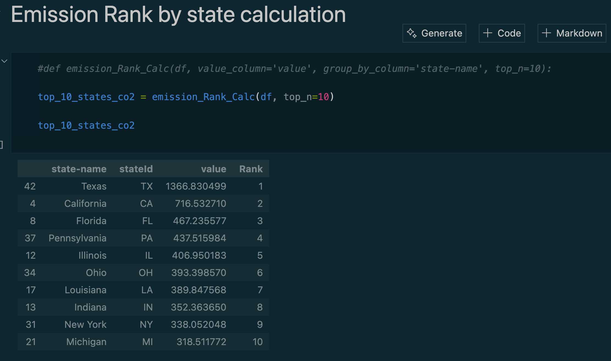
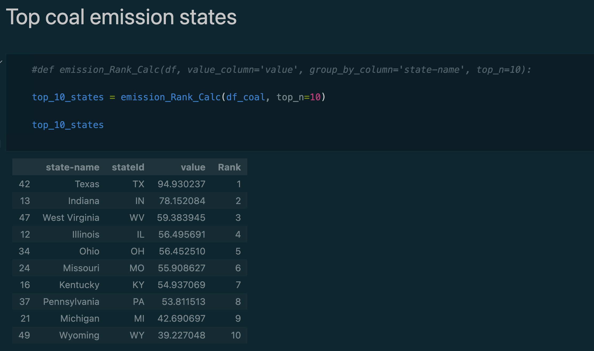
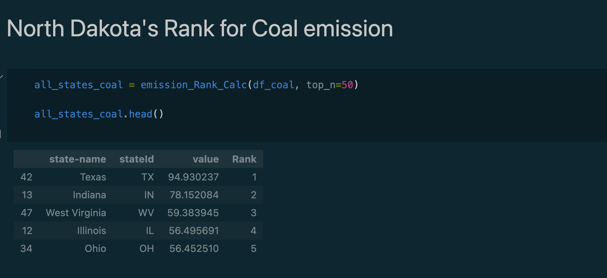

# CO₂ Emission Analysis in the U.S.

Leveraging Data Engineering & Analytics to Identify High-Emission States

### US Energy Information

### 📌 Project Overview

This project extracts CO₂ emissions data from the U.S. Energy Information Administration (EIA) API, processes it, and stores the refined dataset in Azure Blob Storage for further analysis. The goal is to uncover emission trends and identify the states contributing the most CO₂, with a breakdown by energy sources (e.g., coal).

### 🔗 Data Source

EIA Open Data (U.S. Energy Information Administration)

https://www.eia.gov/opendata/

### ⚙️ Tech Stack

Programming Language: Python
Data Ingestion: API integration with EIA
Data Storage: Azure Blob Storage
Data Processing: Pandas, PySpark

### 🚀 Key Features

✔ Automated Data Pipeline: Fetches CO₂ emissions data via EIA API and processes it programmatically.

✔ Cloud-Based Storage: Stores transformed datasets in Azure Blob Storage for scalable analytics.

✔ State-Level CO₂ Analysis: Identifies the highest-emitting U.S. states overall and by specific sources (e.g., coal).

✔ Visual Insights: Generates interactive data visualizations for emissions ranking.

## Insights

</p
